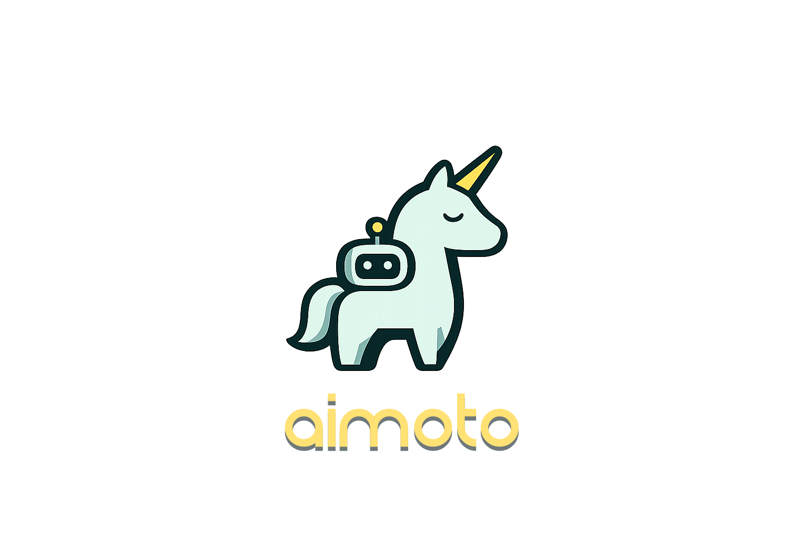

<p align="center">
  
</p>

<p align="center"><strong>A local AI workspace that adapts to what you need — while you stay in control.</strong></p>

# AI-Mo-To

AI-Mo-To gives a coding agent a canonical, human-owned workspace in which to build a real local application. The workspace is ordinary files plus a small `.aimoto` metadata directory. AI-Mo-To does not classify the request or preselect an application shape.

## How it works

1. Run `aimoto request "<need>" --workspace <path>`. AI-Mo-To creates or reuses the workspace and returns an implementation brief.
2. The coding agent implements the requested UI, callbacks, scripts, and assets directly beneath the returned workspace root, then verifies them.
3. The agent explains the completed work and asks whether to save it. Only after explicit approval in a later message does it run `aimoto version create --workspace <path> --message "<summary>"`.
4. `aimoto version restore <version-id> --workspace <path>` restores captured files as a new version, preserving prior history.

`request` never implements files or creates a version. This separation lets the person review working behavior before deciding whether it becomes a durable recovery point.

## Get started

### Install on Windows

```powershell
irm https://raw.githubusercontent.com/dado-ph/AI-Mo-To/main/scripts/install.ps1 | iex
```

Open a new PowerShell terminal and run `aimoto --help`.

### Create and implement a workspace

```powershell
$workspace = Join-Path $env:LOCALAPPDATA "AI-Mo-To\workspaces\garden"
aimoto workspace create "Garden" --root $workspace
aimoto request "Build a garden planner with a weekly watering view" --workspace $workspace
```

The implementation brief tells the coding agent to continue in `$workspace`. After the agent has implemented and verified the application, it must ask before saving:

```powershell
# Run only after the user explicitly approves saving the completed work.
aimoto version create --workspace $workspace --message "Implement garden planner"
aimoto version list --workspace $workspace
```

See the [Getting Started Guide](docs/getting-started.md) and [CLI reference](docs/manual/cli.md).

## Building from source

Requires Node.js 22+ and pnpm 11+.

```powershell
pnpm install
pnpm build
pnpm validate
pnpm --filter @ai-mo-to/desktop dist
```

## Repository structure

- `apps/cli`: agent- and human-facing workspace/version commands.
- `apps/desktop`: visual workspace manager and version history.
- `packages/engine`: workspace lifecycle and implementation briefs.
- `packages/protocol`: workspace and version contracts.
- `packages/storage`: minimal metadata plus filesystem capture/restore.
- `packages/snapshot`: content-addressed filesystem snapshot verification.
- `packages/foundry`: curated direct-implementation guidance.
- `scripts/acceptance`: installed-product role-play and semantic verifier.

## License

AI-Mo-To is licensed under the [GNU Affero General Public License v3.0 or later](LICENSE).
